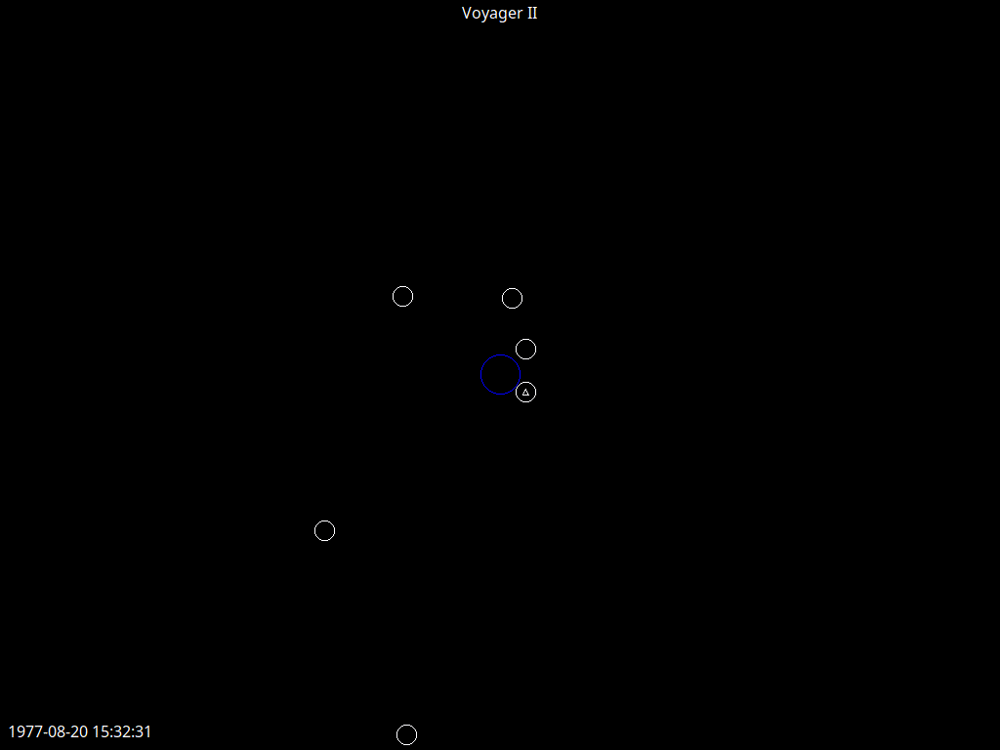
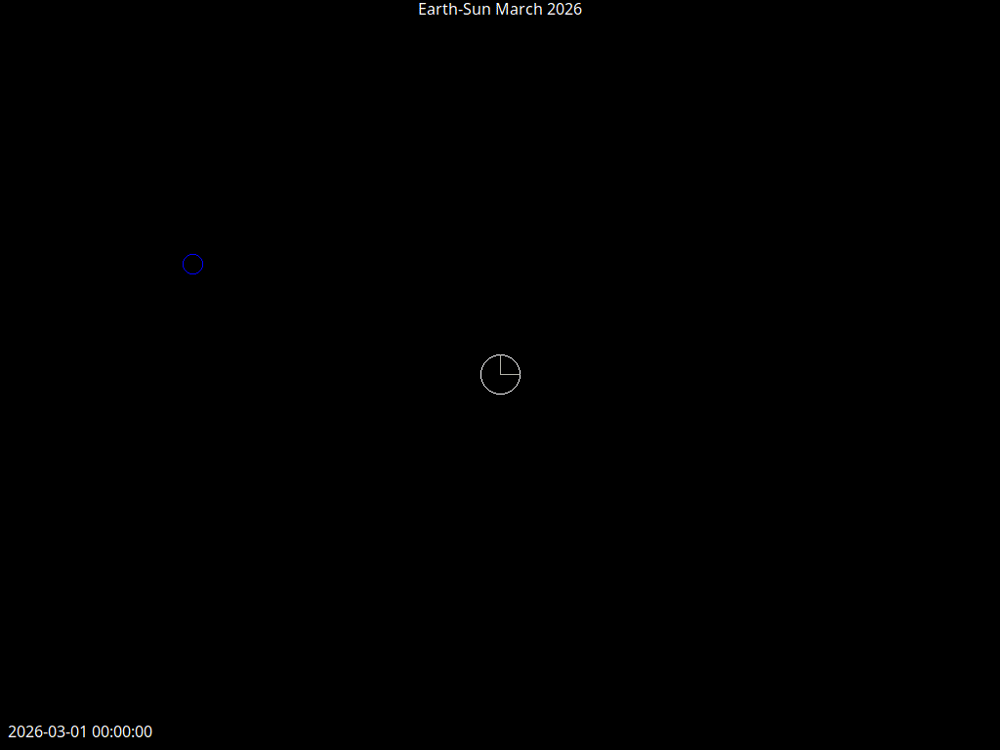
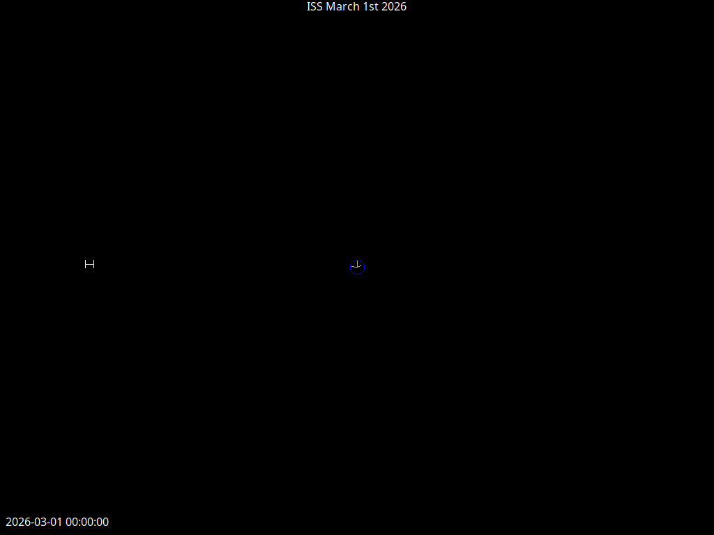

# ephemeral

Parser and visualizer for JPL Ephemeris Files


## Examples

`dune exec -- ephemeral test/voyager_2/*.txt --speed=9 --title="Voyager II" --dynamic-scale`



`dune exec -- ephemeral test/earth_sun_march2026.txt --title="Earth-Sun March 2026" --speed=9`





## Controls

| Key | Effect |
| --- | --- |
| Escape | Exit |
| Space | Pause |
| `,` | Slow down |
| `.` | Speed up |
| `/` | Default speed |
| `z` | Toggle dynamic scaling |

## CLI Usage

```
Usage: ephemeral [OPTION]... [VECTOR_TABLE]...
  --speed    <int>   Sets the starting speed of the simulation
                     (0-9, default=4)
  --dynamic-scale 
             <bool>  Determines whether view scales with scene
                     (default=false)
  --record   <path>  Runs one loop of the ephemerides and calls
                     ffmpeg to render a video from the frames
  --title    <str>   Draws text to the top of the screen
  --help  Display this list of options
```

## Installation

```bash
opam install . --deps-only
dune build
```
