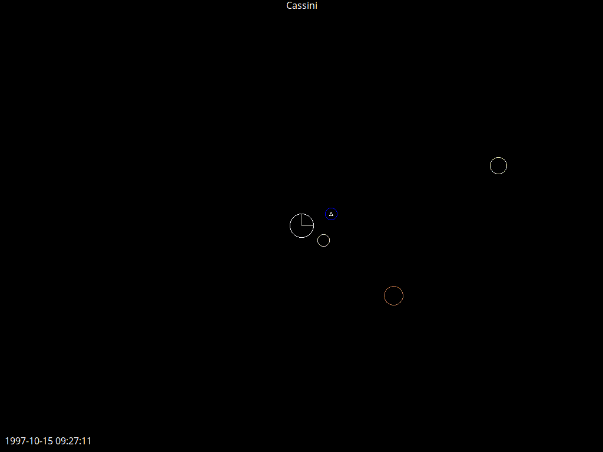
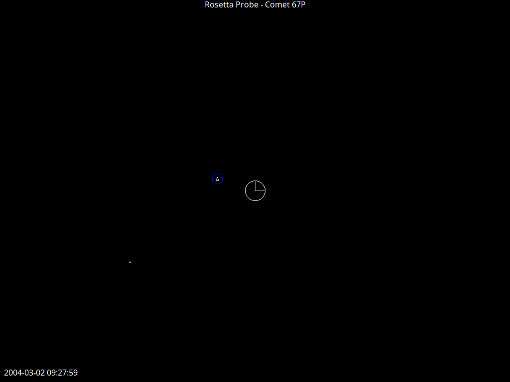

# ephemeral

Parser and visualizer for JPL Ephemeris Files.
Trajectories are available to the public via the [JPL Horizons System](https://ssd.jpl.nasa.gov/horizons/app.html).


## Examples

`dune exec -- ephemeral test/voyager_2/*.txt --speed=9 --title="Voyager II" --dynamic-scale=true`


`dune exec -- ephemeral test/cassini/*.txt --title="Cassini" --speed 5`



`dune exec -- ephemeral test/earth_sun_march2026.txt --title="Earth-Sun March 2026" --speed=9`


`dune exec -- ephemeral test/rosetta/*.txt --title="Rosetta Probe - Comet 67P" --speed=7`



`dune exec -- ephemeral test/parker/*.txt --title="Parker Solar Probe" --phi=-1 --theta=3.93`


`dune exec -- ephemeral test/iss.txt --title "ISS March 1st 2026" --theta=45 --phi -1.25`


## Installation

From opam:

```
opam install ephemeral
```

From source:

```
git clone https://github.com/CharlesAverill/ephemeral.git && cd ephemeral
opam install . --deps-only
make
```

## Controls

| Key | Effect |
| --- | --- |
| Escape | Exit |
| Space | Pause |
| `,` | Slow down |
| `.` | Speed up |
| `/` | Default speed |
| `z` | Toggle dynamic scaling |

## CLI Usage

```
Usage: ephemeral [OPTION]... [VECTOR_TABLE]...
  --speed    <int>   Sets the starting speed of the simulation
                     (0-9, default=4)
  --dynamic-scale 
             <bool>  Determines whether view scales with scene
                     (default=false)
  --theta    <float> Sets the starting azimuth of the viewport
                     (0-6.28, default=0)
  --phi    <float> Sets the starting elevation of the viewport
                     (-1.570796-1.570796, default=0.000000)
  --record   <path>  Runs one loop of the ephemerides and calls
                     ffmpeg to render a video from the frames
  --title    <str>   Draws text to the top of the screen
  --help  Display this list of options
```

If passing multiple vector tables, they must share the same central object (e.g.,
all tables must be heliocentric, or geocentric, or etc.).

## Installation

```bash
opam install . --deps-only
dune build
```
